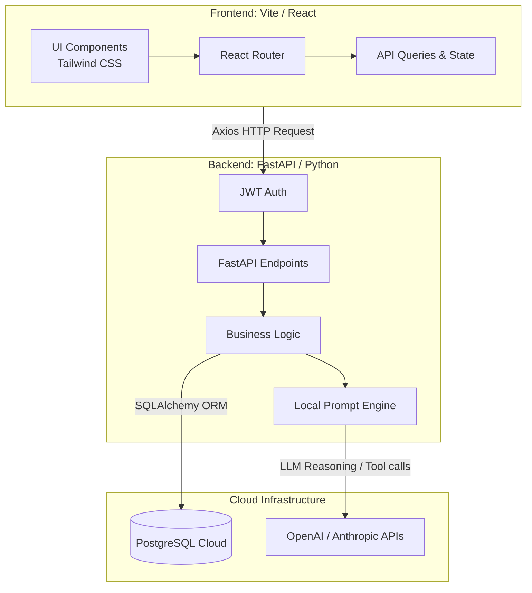

# LearnMate AI

LearnMate AI is a smart teaching assistant platform made for modern schools. It has different parts for instructors and students. We built this to show how to quickly create a production-ready SaaS app using advanced AI coding tools (Claude Code), Agent workflows, and full-stack automatic deployments.
## Architecture Diagram


## 📍 Online Demo

> [!IMPORTANT]
> **Network Latency (Cold Start) Note**  
> We use Render's free tier for our backend. If nobody uses the app for a while, the server goes to sleep to save money. So, **your first login might take about 3 minutes to load**. This is normal. Please wait while it wakes up. After that, it will be fast!

* **Frontend (Vercel)**: [https://learn-mate-ai-zeta.vercel.app](https://learn-mate-ai-zeta.vercel.app)
* **Backend (Render)**: [https://learnmate-api.onrender.com](https://learnmate-api.onrender.com)

### 🔑 Test Accounts

You can try the app easily using these test accounts:

**👨‍🏫 Instructor Role**
* **Account**: `robert.smith@university.edu`
* **Password**: `owEuWEmcl2Xx`

**🎓 Student Role**
* **Account (Student A)**: `alex.johnson@student.edu`
* **Password**: `dUfkhVsX8vJQ`
* **Account (Student B)**: `emily.davis@student.edu`
* **Password**: `OKmjlTF25O2r`

---

## 🚀 Core Features & Smart Designs

We did not want to make a simple CRUD app. Instead, we created special features to solve real problems in education:

### 1. Instructor Features
* **Safe Content Control**
  * **Design**: To stop the AI from generating harmful or biased content, instructors can set an "audience profile" for the class. The Prompt Engine uses this profile to make sure the AI respects cultural and psychological safety.
* **Live Class Report Dashboard** 
  * **Design**: Instead of boring tables, our dashboard calculates class averages in real time. It uses backend QuizSubmission data to show an "Error Distribution Radar." This helps instructors see what the class is struggling with without breaking student privacy.

### 2. Student Features
* **Interactive 3D Flashcards**
  * **Design**: Reading long texts is tiring. We used CSS3 to build real-feeling 3D flipping flashcards. The LLM summarizes long PDFs into these fun, pocket-sized cards.
* **Smart Quizzes with Helpful Feedback**
  * **Design**: We used a step-by-step layout for taking quizzes. When you finish, the LLM API quickly gives you a Score Badge and deep feedback on your mistakes. It feels like a real tutor is grading your test.

### 3. Setup & Security
* **Data Safety by Role**
  * **Design**: We use React Context and strict router rules so that students and instructors can only see their own data. This completely blocks accounts from seeing data they shouldn't.

---

## 🏗 System Architecture

The app is built to handle many users, keep data safe, and connect securely with APIs:



---

## 🛠 Tech Stack

* **Frontend**: React.js 18, Vite, React Router DOM, Tailwind CSS (with Skeleton loading)
* **Backend**: Python 3.10+, FastAPI, Pydantic, SQLAlchemy ORM
* **Database**: PostgreSQL Cloud (Neon/Render DB)
* **CI/CD Pipeline**: GitHub Actions
* **Quality & Security**: ESLint, Flake8, Gitleaks, Bandit, NPM Audit

---

## 🤖 Claude Code & Workflow

A big highlight of this project is how we used AI to build it, following the Project 3 Guidelines:

1. **Test-Driven Development (TDD)**
   * To stop AI mistakes, we used Pytest integration loops. This forces the model to follow Pydantic Schemas exactly.
2. **AI Agent Environment (`.claude`)**
   * The project has special prompt rules in `CLAUDE.md`. We also set up a custom Git hook that stops developers from pushing code if tests fail. This keeps the code high quality.
3. **Security & CI/CD Pipeline**
   * Our 9-stage CI pipeline checks for secrets (Gitleaks), deploys the code, and runs AI Code Reviews automatically on the master branch.

---

## 💻 Local Development Setup

To run this app on your computer:

```bash
# 1. Download the code (Look at .env.example for variables)
git clone <repository-url>
cd LearnMateAI

# 2. Start the frontend (Port: 5200)
cd client
npm install
npm run dev

# 3. Start the backend API (Port: 8200)
cd server
python3 -m venv venv
source venv/bin/activate
pip install -r requirements.txt
python -m uvicorn main:app --reload --port 8200
```

---

## License & Project Info

**Copyright © 2026 LearnMate Team. All Rights Reserved.**

This repository is an academic project for grading in Project 3. You may not copy, share, or sell this code. 

> **Visual Drafts:**
> Early design screenshots from the `/init` sprint:
> [Draft 1](https://github.com/user-attachments/assets/cd358470-668c-4226-8a37-af7739b2b528) | [Draft 2](https://github.com/user-attachments/assets/502f65f4-c737-4121-a22c-42fa8c3fd00e)
