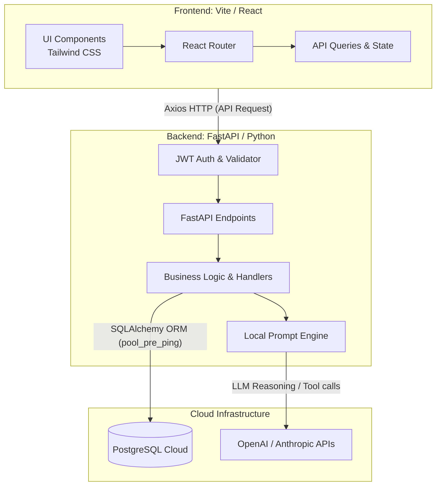

# LearnMate AI

LearnMate AI is an intelligent teaching assistant platform tailored for modern educational scenarios. By providing independent, multi-platform role experiences, we explore and demonstrate how to accelerate the implementation of production-level SaaS platforms using advanced AI coding assistants (Claude Code Mastery), Agent workflows, and full-stack automated deployments.

## 📍 Online Demo

> [!IMPORTANT]
> **Important Note on Network Latency (Cold Start)**  
> To manage costs, our backend is deployed on Render's free tier. If there's no active traffic for a while, the server automatically spins down to sleep. Therefore, **your first login or request might experience a loading delay of approximately 3 minutes**. This waking-up phase is normal—please wait patiently. Operations will quickly resume normal response times once the server is awake.

* **Frontend (Vercel)**: [https://learn-mate-ai-zeta.vercel.app](https://learn-mate-ai-zeta.vercel.app)
* **Backend (Render)**: [https://learnmate-api.onrender.com](https://learnmate-api.onrender.com)

### 🔑 Test Accounts

For the convenience of Instructors/TAs wanting a quick walkthrough of different roles, we strongly suggest logging in via the built-in test accounts:

**👨‍🏫 Instructor Role**
* **Account**: `robert.smith@university.edu`
* **Password**: `owEuWEmcl2Xx`

**🎓 Student Role**
* **Account (Student A)**: `alex.johnson@student.edu`
* **Password**: `dUfkhVsX8vJQ`
* **Account (Student B)**: `emily.davis@student.edu`
* **Password**: `OKmjlTF25O2r`

---

## 🚀 Core Features & Design Ingenuities

We rejected making a simple CRUD app. By analyzing core user stories and Issues, we implemented a series of unique engineering interactions and UX solutions addressing real pain points in educational scenarios:

### 1. Instructor Module
* **Harm-Aware Audience Customization**
  * **Design Ingenuity**: To proactively mitigate cultural or psychological harm in AI-generated materials (quizzes, flashcards), we empowered instructors with the ability to customize the "audience profile" for the class. When the system generates content, the underlying Prompt Engine heavily incorporates the instructor's predefined audience sensitivity profile to preempt AI hallucinations and biases at the root. This achieves state-of-the-art "Harm-Aware" content moderation.
* **Real-time Instructor Report Dashboard** 
  * **Design Ingenuity**: Dismissing rigid flat tables, we bridged total data continuity with `QuizSubmission` instances on the backend. This dashboard calculates dynamic class averages in real time and stealthily aggregates anonymous student testing figures into an "Error Distribution Radar." This allows instructors to instantly visualize "collective blind spots" across the class—without infringing on individual privacy—and adapt pacing accordingly.

### 2. Student Module
* **3D Interactive Immersive Flashcards**
  * **Design Ingenuity**: Combatting text fatigue, we leveraged CSS3 to build **3D dual-sided flipping flashcards with realistic depth-of-field**. Coupled with LLM summarization endpoints, dense PDF context is transformed into pocket-sized, interactive "playables." The smooth physical feedback dramatically increases the gratification of micro-learning.
* **Progressive Quizzes with Human-like Feedback (Interactive Quiz Taking UI)**
  * **Design Ingenuity**: Eschewing monotonous long scroll-forms, we employed an intensive "single-question stepper card" layout. Most remarkably, upon submission, the system rapidly calls the LLM API to render an animated **Score Badge** accompanied by in-depth diagnostic feedback targeting the student's specific mistakes. This delivers a highly immersive presence, mirroring a private teaching assistant marking your test face-to-face.

### 3. Core Architecture & Access Control
* **Data-driven Routing & Identity Demarcation**
  * **Design Ingenuity**: We entirely scrapped hardcoded frontend roles. Utilizing JSON configuration logic as a single source of truth, combined with React Context and strict routing guards (404 / Unauthorized Redirections), any logged-in identity is securely bound to their assigned data-mesh within milliseconds. This completely shuts out cross-account data sniffing.

---

## 🏗 System Architecture

Engineered for high concurrency, decoupled workflows, and multilayer security, this platform operates on a robust Client-Server architecture:



---

## 🛠 Tech Stack

* **Frontend**: React.js 18, Vite, React Router DOM, Tailwind CSS (with seamless A11y Skeleton rendering)
* **Backend**: Python 3.10+, FastAPI (ASGI), Pydantic, SQLAlchemy ORM
* **Database**: PostgreSQL Cloud (Neon/Render DB)
* **CI/CD Pipeline**: GitHub Actions
* **Quality Gates**: ESLint, Flake8, Gitleaks, Bandit, NPM Audit

---

## 🤖 Claude Code Mastery & Workflow

The absolute core highlight of this repository lies squarely in matching the exact development lifecycle criteria set forth by the **Project 3 Requirement Guidelines**:

1. **Test-Driven Development Engine (Red-Green-Refactor)**
   * To permanently eradicate LLM hallucinations during high-stakes Quiz generation endpoints, we bottlenecked the entire prompt-response framework via a robust **TDD** pipeline. Emplacing intensive Pytest integration loops forces the model outputs to comply precisely with Pydantic Schemas. 
2. **Comprehensive `.claude` AI Agent Environment**
   * The project ecosystem hosts intricate prompt strategies (`CLAUDE.md`) paired with multiple Hook interceptions. Case in point: a customized Git hook structurally prevents developers from committing code should the test suites remain shattered—enforcing an iron-clad quality floor directly within the terminal.
3. **Security Gates & CI/CD Pipeline**
   * Running sophisticated Parallel Worktrees across UI branches, our master branch merges undergo a grueling 9-Stage CI pipeline spanning Gitleaks detection through synchronized deployments and fully autonomous algorithmic C.L.E.A.R AI Code Reviews.

---

## 💻 Local Development Setup

To evaluate this platform locally:

```bash
# 1. Clone repository (Reference .env.example for variables)
git clone <repository-url>
cd LearnMateAI

# 2. Spin up frontend (Port: 5200)
cd client
npm install
npm run dev

# 3. Spin up backend API (Port: 8200)
cd server
python3 -m venv venv
source venv/bin/activate
pip install -r requirements.txt
python -m uvicorn main:app --reload --port 8200
```

---

## License & Assets Archive

**Copyright © 2026 LearnMate Team. All Rights Reserved.**

This repository and its codebase serve as an academic proprietary delivery. Interaction flows and architectural IP are strictly reserved for grading perusal by the officiating Instructors & TAs of the associated course (Project 3). Third-party duplication, syndication, or commercial monetization is forcefully prohibited.

> **Visual Archives:**
> Base mockup screenshots logged during the `/init` repository mapping sprint:
> [Initialization Draft 1](https://github.com/user-attachments/assets/cd358470-668c-4226-8a37-af7739b2b528) | [Initialization Draft 2](https://github.com/user-attachments/assets/502f65f4-c737-4121-a22c-42fa8c3fd00e)
