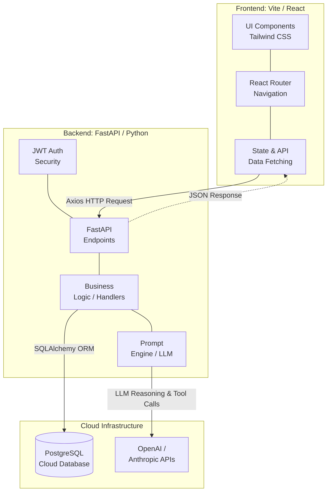

# LearnMate AI

LearnMate AI 是一款针对现代教育场景打造的智能助学平台。我们通过提供多端独立的角色体验，探索和演示了如何通过高阶的 AI 编码助手（Claude Code Mastery）、Agent 工作流和全套自动化部署来加速产品级 SaaS 平台的落地方案。

## 📍 在线体验说明

> [!IMPORTANT]
> **关于网络延迟 (Cold Start) 的重要提示**  
> 为了控制成本，我们的后端部署在 Render 的免费服务层上。如果一段时间没有活跃访问，服务器会自动休眠。因此，**您的首次登录或进行请求操作时，可能会遇到大约 3 分钟的延迟加载**。这属于休眠唤醒的正常现象，请耐心等待服务器“唤醒”，启动完成后即可恢复极速响应。

* **前端环境 (Vercel)**: [https://learn-mate-ai-zeta.vercel.app](https://learn-mate-ai-zeta.vercel.app)
* **后端环境 (Render)**: [https://learnmate-api.onrender.com](https://learnmate-api.onrender.com)

### 🔑 测试演示账号

为方便教师/TA快速体验不同角色权限，建议使用系统预置的测试账号直接登录：

**👨‍🏫 教师角色 (Instructor)**
* **账号**: `robert.smith@university.edu`
* **密码**: `owEuWEmcl2Xx`

**🎓 学生角色 (Student)**
* **账号 (学生 A)**: `alex.johnson@student.edu`
* **密码**: `dUfkhVsX8vJQ`
* **账号 (学生 B)**: `emily.davis@student.edu`
* **密码**: `OKmjlTF25O2r`

---

## 🚀 核心功能与设计巧思

我们在功能设计上拒绝了简单的 CRUD，而是通过对 Issues 及核心用户故事的梳理，落地了一系列解决师生痛点的独特交互与工程巧思：

### 1. Instructor 教师模块
* **AI 伤害感知与受众自定义 (Harm-Aware Audience Customization)**
  * **设计巧思**：为了最大限度地减少 AI 生成内容（测验、闪卡等）可能带来的文化或心理偏见伤害，我们赋予了教师高度自定义课程“受众画像”的权限。系统在生成辅助资料时，其底层的 Prompt 引擎会主动结合教师预设的课堂受众敏感度，从根源上降低 AI 输出的不良倾向对学生造成的潜在负面影响，实现了业界前沿的“伤害感知（Harm-Aware）”内容把控。
* **实时学情全景看板 (Instructor Report Dashboard)** 
  * **设计巧思**：放弃了死板的扁平表格，我们在后端打通了 `QuizSubmission` 的全域数据连通。看板不仅能实时计算全班动态均分，还能无感收集学生数据，进行“班级匿名测验分析”和“易错知识点聚合”，让教师在不侵犯学生隐私的前提下，一眼看穿“全班都没搞懂的知识盲区”并及时调整授课策略。

### 2. Student 学生模块
* **3D 沉浸式知识闪卡 (Interactive Flashcards)**
  * **设计巧思**：针对密集阅读带来的疲惫感，我们在前端运用 CSS3 构建了带真实景深动画的 **3D 双面翻转闪卡 UI**。配合大模型的内容提炼接口，将晦涩的课程摘要直接幻化为一套套可以手动“把玩”的口袋卡片，顺滑的物理交互极大地增强了随时随地进行碎片化记忆的临场感。
* **渐进式测验与真人级解卷反馈 (Quiz Taking UI)**
  * **设计巧思**：摈弃了枯燥的一卷到底长表单，采用专注感极强的“单题目步进式卡片”。更重要的是，学生提交试卷的瞬间不仅仅是为了拿个分数，系统会调用 LLM API 即刻渲染一个动态计分的智能徽章 (Score Badge)，并结合学生的具体提交给出详细到逻辑层的纠正分析。由于是在动态过程中返回，这提供了一种宛如“私人助教面对面给你批卷子”的爽快感。

### 3. 底层架构与安全控权
* **身份隔离与动态数据路由引擎**
  * **设计巧思**：彻底抛弃了前端硬编码管理用户的传统做法，利用 JSON 数据底座作为单一数据源支撑，配合 React Context 和严格的路由守卫 (404 / Unauthorized Redirects)。任何身份一经登录便在毫秒级被隔离至他专属的数据维度视图下，杜绝跨角色的非法数据探嗅。

---

## 🏗 系统架构图 (System Architecture)

基于对高并发、解耦合开发与安全性多维度的考量，本平台采用客户端-服务器 (Client-Server) 分离架构：


<br/>

<details>
<summary><h3> 📊 点击此处展开 Mermaid 架构源码 </h3></summary>

<br/>



</details>

---

## 🛠 技术栈 (Tech Stack)

* **Frontend**: React.js 18, Vite, React Router DOM, Tailwind CSS (全套 A11y 骨架屏降级支持)
* **Backend**: Python 3.10+, FastAPI (ASGI), Pydantic, SQLAlchemy ORM
* **Database**: PostgreSQL Cloud (Neon/Render DB)
* **CI/CD Pipeline**: GitHub Actions
* **Quality Gates**: ESLint, Flake8, Gitleaks, NPM Audit, Bandit

---

## 🤖 Claude Code 工具链与工程规范 (Mastery & Workflow)

本项目全方位贴合 Project 3 的极客开发要求，深度贯彻了 AI 配合敏捷开发的最新流水线：

1. **基于 TDD 的 LLM 管控防线 (Red-Green-Refactor)**
   * 对于测验生成这种容易出现幻觉的高危 API，我们将生成的 prompt 验证全程覆盖为 TDD 测试链条。通过撰写高强度的 Pytest 测试用例，强制模型回应必须命中 Pydantic Schema 的要求标准，彻底把控了内容输出的有效性。
2. **系统级 `.claude` 智能伴生环境**
   * 我们精心调和了系统级的工作流 (`CLAUDE.md`) 与智能 Hook。引入严苛的代码防劣化策略，如果在带有未跑通状态的代码上执行 commit 时，Git 会直接唤起拦截警告将其阻断终止。
3. **DevSecOps 与九段式 CI 流水线**
   * 从利用 Worktree 铺开并行 UI 探索起步，我们还在 GitHub 主干上注入了全面的自动化 Action 执行步骤——囊括密文泄露检查到并行部署再到借助 Agent 进行全自动代码 C.L.E.A.R Review——呈现真正的产品级交付链路。

---

## 💻 快速本地部署 (Local Development Setup)

如果需要在本地运行或体验：

```bash
# 1. 获取代码库 (环境配置文件可参考根目录 .env.example)
git clone <repository-url>
cd LearnMateAI

# 2. 启动客户端 (端口 5200)
cd client
npm install
npm run dev

# 3. 启动服务端环境 (端口 8200)
cd server
python3 -m venv venv
source venv/bin/activate
pip install -r requirements.txt
python -m uvicorn main:app --reload --port 8200
```

---

## 版权与开发素材档案 (License & Assets)

**Copyright © 2026 LearnMate Team. All Rights Reserved.**

本应用包含其衍生模型、UI 重塑组件受限于教育版权管理。相关核心代码目前只对审核课程(Project 3)对应的工作室教授及助教开放评价权限，杜绝外部复制、倒卖或是剥离做进一步商用。

> **影像记录区**：
> 早期 `/init` 工程创建时的基础脚手架截图纪实：
> [脚手架视图 1](https://github.com/user-attachments/assets/cd358470-668c-4226-8a37-af7739b2b528) | [脚手架视图 2](https://github.com/user-attachments/assets/502f65f4-c737-4121-a22c-42fa8c3fd00e)

---

## 📑 Project 3 证据清单与作业要求对应表

| 评分项目 (Requirement) | 落地与完成说明 (Implementation Details) | 证明文件与截图 (Evidence Link) |
|------------------------|-----------------------------------------|--------------------------------|
| **CLAUDE.md & Memory** | 我们创建了包含模块化 `@imports` 的 `CLAUDE.md`。项目上下文档案与对话通过 `chathistory_P3.md` 持久化记忆，并且 Git 历史中留存了演变过程。 | [chathistory_P3.md](planning_files/chathistory_P3.md) <br> [CLAUDE.md](CLAUDE.md) |
| **Custom Skills** | 我们引入了 `everything-claude-code` 插件体系，搭建了远超 2 个的自定义技能，完成工作流加速。 | [证据 1 (截图)](docs/screenshot/12_evidence_1_successfully_add_marketplace_proof.png) |
| **Hooks** | 按要求配置了 Pre/Post hooks。特别是建立了一个强效质量拦截门（Stop Hook），它能在 Pytest 失败时强制阻断 `git commit` 操作。 | [证据 2 (截图)](docs/screenshot/13_evidence_2_stop_hook.png) |
| **MCP Servers** | 在工作区集成配置了 GitHub MCP 服务，成功利用大模型自动查阅项目 PR 和 Issue，配置独立保存在 `.mcp.json` 中。 | [证据 4 (截图)](docs/screenshot/15_evidence_4_mcp_open_issues.png) |
| **Agents** | 除了应用侧的 Agent SDK 集成，在项目流程中也深度使用了诸如代码审查 (Doc-Reviewer) 等专业分身，辅助代码质控。 | [证据 3 (截图)](docs/screenshot/14_evidence_3_doc_reviewer_agent.png) <br> [project3-agents.md](docs/project3-agents.md) |
| **Parallel Development** | 我们利用 Git worktree 将目录物理分离，实现了两个前端分支 (`quiz-ui` 与 `flashcard-ui`) 在多个终端并驾齐驱的开发。 | [证据 5 (截图)](docs/screenshot/16_evidence_5_worktree_list.png) <br> [证据 7b (截图)](docs/screenshot/17_evidence_7b_parallel_terminals.png) |
| **Writer/Reviewer + C.L.E.A.R.** | AI 完成主体代码 (Writer) 后，由另一套专职的 Reviewer Agent 接管对 PR 的审查，并完全按照 C.L.E.A.R 框架给出反馈。 | [证据 8: PR 36 审查](docs/screenshot/21_clear_pr_36_review.png) <br> [证据 8: PR 37 审查](docs/screenshot/22_clear_pr_37_review.png) <br> [证据 10: PR 20 审查](docs/screenshot/20_evidence_10_clear_pr_comment.png) |
| **Test-Driven Development** | 完美执行了红绿灯 (Red-Green-Refactor) TDD 流程。确保了必定有红字报错 commit 先于绿字通过 commit，整体后段覆盖率大于 70% 并在 Playwright 补齐 E2E。 | [证据 6 (红灯阶段)](docs/screenshot/01_RED_phase_failing_tests.png) <br> [证据 7 (绿灯阶段)](docs/screenshot/02_01_GREEN_phase_passed.png) <br> [证据 11 (E2E)](docs/screenshot/18_evidence_11_playwright_e2e_report.png) |
| **CI/CD Pipeline & Security** | 我们在 GitHub Actions 中搭建了完整的 9 阶段流水线。包含了测试、构建，以及 npm audit / Gitleaks / Bandit 等四大安全门防护。 | [证据 9 (CI 全绿)](docs/screenshot/19_evidence_9_github_actions_all_green.png) <br> [证据 12 (PR 检查)](docs/screenshot/22_evidence_12_github_actions_pr.gif) |
| **Team Process** | 严格实行 Scrum 的 Branch-per-issue 标准流程，并且整理了完善的 Sprint Plans 作为团队协作证明。 | [learnmate-sprint-plan.md](docs/learnmate-sprint-plan.md) |
| **Usability Study** | 对平台进行了可用性测试（包含学生和教师双重视角），并记录了测试流程与用户反馈。 | [Report](docs/Usability_Study_Report.md) <br> [General Video](docs/instructor%20general%20usability%20video.mov) <br> [Quiz Video](docs/instructor%20create%20quiz%20usability%20video.mov) |
| **Application Quality (应用质量与部署)** | 落地了具有极高完成度与前沿设计质感的 SaaS 应用，打通了教与学的双角色动态权限，并已稳定部署在 Vercel 和 Render 上供公开访问。 | [在线环境 (Vercel)](https://learn-mate-ai-zeta.vercel.app) <br> [后端 API (Render)](https://learnmate-api.onrender.com) |
| **Technical Blog (技术博客)** | 在外部平台发布了深度技术博客，复盘了项目的架构设计、核心业务流以及 Claude Code 是如何大幅加速敏捷迭代的。 | [技术博客 (Melanie)](https://www.melanieyang.info/post/building-learnmate-ai-engineering-practices-for-a-full-stack-educational-platform-with-claude-code) <br> [技术博客 (Jing)](https://dev.to/jing_2026/learnmateai-building-an-intelligent-teaching-assistant-platform-48pb) |
| **Individual Reflections (个人反思)** | 整理了超过 500 字的深度反思文档，总结了在项目中落地 TDD、Hooks 与 MCP 的个人体验和爬坑经验。 | [个人总结 (Liuyi)](docs/P3_Reflection_Liuyi_zh.md) <br> [个人总结 (Jing)](docs/REFLECTION_byJing.md) |
| **Peer Review (互评)** | 撰写了针对团队成员 Jing 的专业互评文档，总结了其在项目生命周期中的突出贡献与无缝协作经历。 | [互评档案 (Jing)](docs/Peer_Review_Liuyi_to_Jing.md) |
| **Video Demonstration (视频演示)** | 制作了一段项目演示短片，不仅展示了应用的核心功能流，也直观呈现了背后的 AI 自动化流水线操作。 | *(待录制)* |
| **Showcase Submission (最终提交)** | 将所有的项目链接、封面缩略图、演示视频等核心成果打包汇总，并通过课程规定的 Google 表单顺利上交。 | `已通过 Google Form 提交` |
