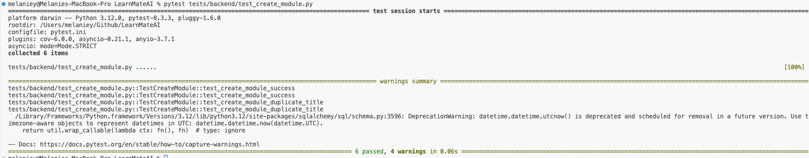
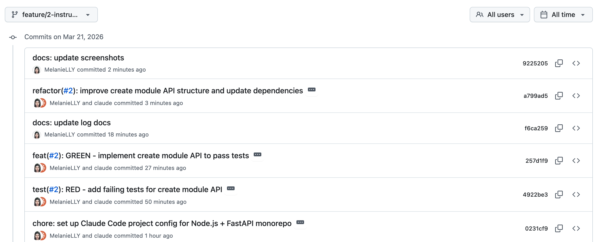
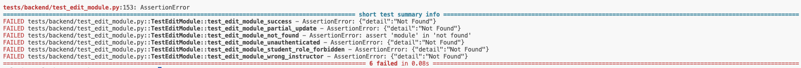
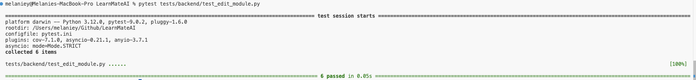
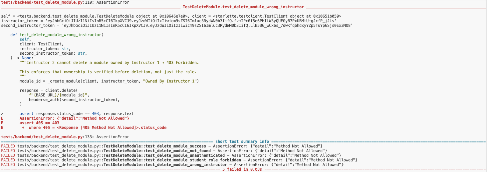
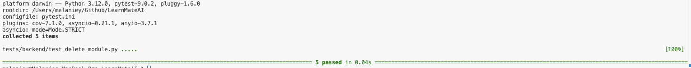

# Homework 4 Claude Code Session Log

## Session 1: Project Setup (/init)

### 1. Claude Configuration Suggestions (Terminal Log)

**User Prompt:**
> Please run /init to set up the project. We already have a CLAUDE.md, but I need you to review it, ensure it covers Node.js + FastAPI architectures, TDD testing rules, and set up the allowed tools and directories in .claude/settings.json.

**Claude Output:**
```text
1. CLAUDE.md: References "Next.js" but the stack is Vite/React; has Prisma commands but the backend is Python/FastAPI; missing Python commands and conventions.
2. settings.json: Uses a non-standard format for Claude Code permissions.

Let me fix both.

... (Prompted for update-config permission, User selected "Yes and don't ask again") ...

Done. Here's a summary of what was changed:

.claude/settings.json — Rewritten to use the proper Claude Code permissions format:
- permissions.allow: explicit Bash(cmd:*) patterns for all allowed commands (npm, git, npx, node, python/3, pytest, pip/3, uvicorn, alembic) + Edit/Write for src/**, tests/**, CLAUDE.md
- permissions.deny: explicit Edit/Write denials for .env, node_modules/**, .git/**
- Removed stale prisma/** from write allowlist (not applicable for FastAPI)

CLAUDE.md — Three fixes:
1. Commands: Replaced "Next.js" dev server comment + Prisma commands with correct Vite frontend commands and FastAPI/Python commands (uvicorn, pytest, alembic, pip)
2. Python Conventions: New section added covering PEP 8, type hints, docstrings, logging, FastAPI project structure, SQLAlchemy/Alembic/Pydantic, and pytest mocking rules
3. Permissions section: Updated to match new allowed commands list and removed prisma/**
```

### 2. Final `.claude/settings.json` File Content

```json
{
  "permissions": {
    "allow": [
      "Bash(npm:*)",
      "Bash(npx:*)",
      "Bash(node:*)",
      "Bash(python:*)",
      "Bash(python3:*)",
      "Bash(pytest:*)",
      "Bash(pip:*)",
      "Bash(pip3:*)",
      "Bash(uvicorn:*)",
      "Bash(alembic:*)",
      "Edit(src/**)",
      "Write(src/**)",
      "Edit(tests/**)",
      "Write(tests/**)",
      "Edit(CLAUDE.md)",
      "Write(CLAUDE.md)"
    ],
    "deny": [
      "Edit(.env)",
      "Write(.env)",
      "Edit(node_modules/**)",
      "Write(node_modules/**)",
      "Edit(.git/**)",
      "Write(.git/**)"
    ]
  }
}
```

## Session 2: Context Management (/compact)

**User Prompt:**
> /compact

**Claude Output:**
```text
  ⎿  Compacted (ctrl+o to see full summary)
  ⎿  Read .claude/settings.json (32 lines)
  ⎿  Read planning files/learnmate-sprint-plan.md (93 lines)
  ⎿  Skills restored (update-config)
```

## Session 3: Explore & Plan

**User Prompt:**
> We are working on Issue #2: Instructor Module Management API.
> First, use your Explore tools (Glob, Grep, Read) to understand the current backend directory structure (specifically FastAPI routes, schemas, and tests).
> Then, switch to the planning phase. Provide a step-by-step TDD plan (Red-Green-Refactor) for implementing the Create Module API. Do NOT write the actual endpoint code yet.

**Claude Output (TDD Plan Overview):**
```text
  ---                                                                                                                                                                                                                                               
  Summary of Commits
                    
  test(#2):    RED   - add failing tests for create module API
  feat(#2):    GREEN - implement create module endpoint to pass tests                                                                                                                                                                               
  refactor(#2): improve create module structure and add docstrings
                                                                                                                                                                                                                                                    
  ---             
  Ready to move to the RED phase — should I write the failing tests now?   
```

## Session 4: Implement - RED Phase

**User Prompt:**
> Now we are entering the RED Phase.
> Do NOT write the actual endpoint code yet. I want you to FIRST write the FULL failing pytest suite for "Create Module".
> To ensure we cover the real business logic, please explicitly include tests for the following scenarios:
> 1. Happy Path: Successfully create a module with valid payload -> Expect 201.
> 2. Missing Title: Fail to create without a required field (e.g., empty or missing title) -> Expect 422.
> 3. Duplicate Title: Fail to create if the same instructor tries to create a module with an already existing title -> Expect 409 Conflict.
> 4. Unauthorized: Fail to create if the requester is not authenticated or not an instructor -> Expect 401/403.
> Write ONLY the failing tests first, executing them via terminal to strictly prove they fail.

**Claude Output (Pytest FAILED Log summary):**
```text
================================ short test summary info =================================
FAILED tests/backend/test_create_module.py::TestCreateModule::test_create_module_success - AssertionError: {"detail":"Not Found"}
FAILED tests/backend/test_create_module.py::TestCreateModule::test_create_module_missing_title - AssertionError: {"detail":"Not Found"}
FAILED tests/backend/test_create_module.py::TestCreateModule::test_create_module_empty_title - AssertionError: {"detail":"Not Found"}
FAILED tests/backend/test_create_module.py::TestCreateModule::test_create_module_duplicate_title - AssertionError: Expected first creation to succeed, got 404: {"detail":"Not Found"}
FAILED tests/backend/test_create_module.py::TestCreateModule::test_create_module_unauthenticated - AssertionError: {"detail":"Not Found"}
FAILED tests/backend/test_create_module.py::TestCreateModule::test_create_module_student_role_forbidden - AssertionError: {"detail":"Not Found"}
=================================== 6 failed in 0.11s ====================================
```

**Screenshot Evidence:**


## Session 5: Implement - GREEN Phase

**User Prompt:**
> The RED phase tests are in place. Now we enter the GREEN phase.
> Please implement the minimum required code in the backend API (FastAPI schemas, routes, main application) to make the 'Create Module' tests PASS.
> Do not over-engineer. Focus strictly on passing the assertions we just wrote.
> After implementing, please RUN the pytest again via terminal to verify we get 100% PASSED.

**Claude Output (Pytest PASSED Log summary):**
```text
============== test session starts ==============
platform darwin -- Python 3.12.0, pytest-8.3.3, pluggy-1.6.0
rootdir: /Users/melaniey/Github/LearnMateAI
configfile: pytest.ini
plugins: cov-6.0.0, asyncio-0.21.1, anyio-3.7.1
asyncio: mode=Mode.STRICT
collected 6 items                               

tests/backend/test_create_module.py ..... [100%]

========= 6 passed, 4 warnings in 0.07s =========
```

**Screenshot Evidence:**


## Session 6: Implement - REFACTOR Phase

**User Prompt:**
> The GREEN phase is complete. Now we enter the REFACTOR phase.
> Please refactor the Create Module code we just wrote. Strictly follow Python PEP 8 conventions, add high-quality docstrings for the new schema and route, and extract any complex logic if necessary.
> Additionally, please review `requirements.txt` and ensure all our backend dependencies (FastAPI, SQLAlchemy, Pytest, etc.) are pinned to their latest stable/LTS versions to avoid future compatibility issues.
> Then run pytest again to ensure nothing broke (REFACTOR phase). 
> Once verified, please commit the changes using message: "refactor(#2): improve create module API structure and update dependencies".

**Claude Output (Git Log Summary):**
```text
a799ad5 refactor(#2): improve create module API structure and update dependencies
257d1f9 feat(#2): GREEN - implement create module API to pass tests
4922be3 test(#2): RED - add failing tests for create module API
```

**Screenshot Evidence:**


## Session 6.5: Explore & Plan (Edit API)

**User Prompt:**
> Before we start writing tests for the Edit API, please use your Explore tools to review how we implemented the Create API (especially the schemas and routes).
> Then output a TDD plan for implementing the Edit Module API.

**Claude Output (TDD Plan summary):**
```text
  ---                                                                                                                                                                                                                                               
  Summary of Edit API Plan
                    
  1. test(#2):    RED   - add failing tests for edit module API (covering 200, 404, 403, 401)
  2. feat(#2):    GREEN - implement edit module endpoint to pass tests                                                                                                                                                                               
  3. refactor(#2): improve edit API security checks and docstrings
  ---             
  Ready to move to the RED phase for Edit API.
```

## Session 7: Edit API - RED Phase

**User Prompt:**
> Great. Now we move to the Edit Module API. Again, enter the RED Phase first.
> Write failing pytest tests for "Edit Module" to cover:
> 1. Happy Path: Successfully edit a module title/description -> Expect 200.
> 2. Not Found: Try to edit a non-existent module -> Expect 404.
> 3. Unauthorized: Not the owner or not authenticated -> Expect 401/403.
> Write ONLY the tests first, run them in the terminal, and prove they FAIL.
> (Do not automatically commit, I will review first.)

**Claude Output (Pytest FAILED Log summary):**
```text
================================ short test summary info =================================
FAILED tests/backend/test_edit_module.py::TestEditModule::test_edit_module_success - AssertionError: {"detail":"Not Found"}
FAILED tests/backend/test_edit_module.py::TestEditModule::test_edit_module_partial_update - AssertionError: {"detail":"Not Found"}
FAILED tests/backend/test_edit_module.py::TestEditModule::test_edit_module_not_found - AssertionError: assert 'module' in 'not found'
FAILED tests/backend/test_edit_module.py::TestEditModule::test_edit_module_unauthenticated - AssertionError: {"detail":"Not Found"}
FAILED tests/backend/test_edit_module.py::TestEditModule::test_edit_module_student_role_forbidden - AssertionError: {"detail":"Not Found"}
FAILED tests/backend/test_edit_module.py::TestEditModule::test_edit_module_wrong_instructor - AssertionError: {"detail":"Not Found"}
=================================== 6 failed in 0.08s ====================================
```

**Screenshot Evidence:**



## Session 8: Edit API - GREEN Phase

**User Prompt:**
> Now, implement the minimum code required in the backend API to make the 'Edit Module' tests pass (GREEN phase). Run pytest again to verify it passes.
> Do not over-engineer, just make sure all 6 tests in test_edit_module.py pass.
> (Do not commit yet, wait for my instruction.)

**Claude Output (Pytest PASSED Log summary):**
```text
====================================================================================================== test session starts =======================================================================================================
platform darwin -- Python 3.12.0, pytest-9.0.2, pluggy-1.6.0
rootdir: /Users/melaniey/Github/LearnMateAI
configfile: pytest.ini
plugins: cov-7.1.0, asyncio-0.21.1, anyio-3.7.1
asyncio: mode=Mode.STRICT
collected 6 items                                                                                                                                                                                                                

tests/backend/test_edit_module.py ......                                                                                                                                                                                   [100%]

======================================================================================================= 6 passed in 0.05s ========================================================================================================
```

**Screenshot Evidence:**



## Session 9: Edit API - REFACTOR Phase

**User Prompt:**
> Now, refactor the Edit Module code. Ensure strict PEP 8 compliance, add high-quality docstrings, and extract complex logic to `module_service.py` if needed. 
> Run tests again to ensure it remains GREEN (REFACTOR phase).
> (Do not commit yet, wait for my instruction.)

**Claude Output (Refactor Summary):**
```text
Before:  update_module() contained inline:                                                                                                                                                                                      
             db.query(Module).filter(Module.id == module_id).first()                                                                                                                                                            
                                                                                                                                                                                                                                
After:   get_module_by_id(db, module_id) → Module | None                                                                                                                                                                        
             mirrors the existing get_module_by_title() pattern                                                                                                                                                                 
             update_module() calls it by name — intent is immediately readable                                                                                                                                                  
             Delete Module (next) will reuse it without duplication                                                                                                                                                             
                                                                                                                                                                                                                                
routers/modules.py — docstring consistency:                                                                                                                                                                                     
Before:  edit_module Raises section missing 422                                                                                                                                                                                 
After:   422 added, matching create_module's Raises section  
```

## Session 10: Delete API - Explore & Plan

**User Prompt:**
> Excellent. Now we move to the final API: Delete Module. 
> Before we start writing tests, please use your Explore tools to check the current db schemas and routes. 
> Then, output a TDD plan for implementing the Delete API. 
> (Do not write any code yet.)

**Claude Output (TDD Plan summary):**
```text
  All 5 tests will fail with 404 {"detail":"Not Found"} (route missing) — clean RED.                                                                                                                                                    
                  
  GREEN — minimum implementation                                                                                                                                                                                                  
                  
  1. delete_module(db, module_id, instructor_id) in module_service.py:                                                                                                                                                            
    - Call get_module_by_id() → raise 404 if None
    - Check module.instructor_id != instructor_id → raise 403                                                                                                                                                                     
    - db.delete(module) + db.commit()                                                                                                                                                                                             
  2. Route in routers/modules.py:                                                                                                                                                                                                 
    - @router.delete("/modules/{module_id}", status_code=204) — no response_model (204 has no body)                                                                                                                               
    - Return None (FastAPI sends empty response automatically)                                                                                                                                                                    
                                                                                                                                                                                                                                  
  REFACTOR — expected improvements                                                                                                                                                                                                
                                                                                                                                                                                                                                  
  - Docstrings on delete_module() and the route handler                                                                                                                                                                           
  - The 404/403 guard sequence in delete_module mirrors update_module exactly — that's intentional and correct.
```

## Session 11: Delete API - RED Phase

**User Prompt:**
> Great plan. Now enter the RED Phase for the Delete Module API.
> Write failing pytest tests for "Delete Module" covering:
> 1. Happy Path: Successfully delete a module -> Expect 200/204.
> 2. Not Found: Try to delete a non-existent module -> Expect 404.
> 3. Unauthorized: Not the owner or not authenticated -> Expect 401/403.
> Write ONLY the tests first, run them, and prove they FAIL.

**Claude Output (Pytest FAILED Log summary):**
```text
=========================================================================================== short test summary info ============================================================================================
FAILED tests/backend/test_delete_module.py::TestDeleteModule::test_delete_module_success - AssertionError: {"detail":"Method Not Allowed"}
FAILED tests/backend/test_delete_module.py::TestDeleteModule::test_delete_module_not_found - AssertionError: {"detail":"Method Not Allowed"}
FAILED tests/backend/test_delete_module.py::TestDeleteModule::test_delete_module_unauthenticated - AssertionError: {"detail":"Method Not Allowed"}
FAILED tests/backend/test_delete_module.py::TestDeleteModule::test_delete_module_student_role_forbidden - AssertionError: {"detail":"Method Not Allowed"}
FAILED tests/backend/test_delete_module.py::TestDeleteModule::test_delete_module_wrong_instructor - AssertionError: {"detail":"Method Not Allowed"}
============================================================================================== 5 failed in 0.08s ===============================================================================================
```

**Screenshot Evidence:**



## Session 12: Delete API - GREEN Phase

**User Prompt:**
> Now, implement the backend code to make the 'Delete Module' tests pass (GREEN phase). Run pytest to verify.
> Ensure all 5 tests pass successfully.

**Claude Output (Pytest PASSED Log summary):**
```text
============================================================================================= test session starts ==============================================================================================
platform darwin -- Python 3.12.0, pytest-9.0.2, pluggy-1.6.0
rootdir: /Users/melaniey/Github/LearnMateAI
configfile: pytest.ini
plugins: cov-7.1.0, asyncio-0.21.1, anyio-3.7.1
asyncio: mode=Mode.STRICT
collected 5 items                                                                                                                                                                                              

tests/backend/test_delete_module.py .....                                                                                                                                                                [100%]

============================================================================================== 5 passed in 0.04s ===============================================================================================
```

**Screenshot Evidence:**

